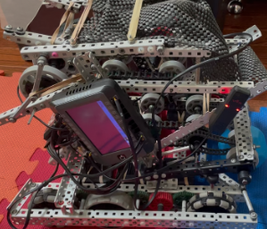

Fall Pushback – VEX PROS Project

This repository holds the code we ran during our 2025 fall season. It covers our early-season drivetrain, basic autonomous routes, and the first version of our wall-stake and pushback systems. It isn’t perfect, but it shows how we tested ideas, learned the field, and built the base that carried us through winter.

About This Robot
This robot “Orbnot”, was our fall build. It was our testbed for:

      Early LemLib odometry setup
      
      PID-based angular and lateral movement
      
      Pushback tuning for the back expansion bar
      
      First drafts of wall-stake code
      
      Subsystems that later moved into our Worlds robot

This Repo Includes: 
      src – All PROS C++ source files
      
      include – Headers and subsystem files
      
      auton (if you created one) – Autonomous routines
      
      deploy – Any extra scripts or configs
      
      config.hpp – Port and tuning info
      
      Example auton routes you can run out of the box

How to Use This Code

      Install PROS (CLI or IDE).
      
      Clone this repo:
      
      git clone https://github.com/yourname/fall-pushback.git
      
      
      Open the folder in VSCode with PROS installed.
      
      Build:
      
      pros make
      
      
      Flash to your brain:
      
      pros mu
      
      
      Tweak your ports in config.hpp.
      
      Update PID values in your LemLib config before running auton.
      
      Use the controller menu or change the “default auton” index in autons.cpp.
      
      Features

Basic drive code with LemLib

      Pushback routine triggered via controller
      
      Stable turning (fall tuning)
      
      Early wall-stake deployment logic
      
      Safe fails and timeouts to avoid runaway motors
      
      Clean folder structure for future expansion

Things Still Being Improved

      Tuning values (they’re fall-season rough)
      
      Autonomous consistency
      
      Wall-stake deployment timing
      
      Motion chaining behavior
      
      Full odometry accuracy (only one tracking wheel in this version)

Credits

Created by Kerry Li (82855S) and the STL Robotics Fall Team.
Built, tested, and rewritten way too many times during late nights in the robotics room.
